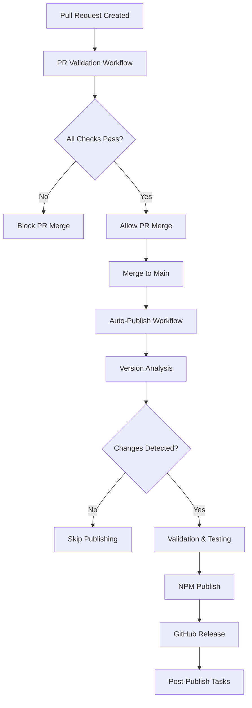

# CI/CD Pipeline Documentation

This document provides comprehensive information about the Continuous Integration and Continuous Deployment (CI/CD) pipeline for the Taskly project.

## Overview

The CI/CD system consists of two main workflows that ensure code quality and automate the publishing process:

1. **PR Validation Workflow** - Validates all pull requests before merge
2. **Auto-Publish Workflow** - Automatically publishes releases when changes are merged to main

## Architecture



## PR Validation Workflow

### Triggers

The PR validation workflow runs on:
- Pull request creation (`opened`)
- Pull request updates (`synchronize`)
- Pull request reopening (`reopened`)
- Pull request ready for review (`ready_for_review`)

### Validation Steps

#### 1. Quality Gates
- **ESLint**: Code linting with error-level warnings
- **Prettier**: Code formatting validation
- **TypeScript**: Type checking and compilation

#### 2. Security Audit
- **Dependency Scanning**: npm audit for vulnerabilities
- **License Validation**: Check for compatible licenses
- **Secret Detection**: Scan for hardcoded secrets
- **Outdated Dependencies**: Identify packages needing updates

#### 3. Test Matrix
- **Cross-Platform Testing**: Ubuntu, Windows, macOS
- **Multi-Version Testing**: Node.js 16.x, 18.x, 20.x
- **Coverage Requirements**: Minimum 80% test coverage
- **Performance Testing**: Bundle size validation

#### 4. Build Validation
- **Production Build**: Verify CJS, ESM, and TypeScript builds
- **Entry Point Validation**: Ensure all declared entry points exist
- **CLI Testing**: Verify executable functionality
- **Bundle Size Check**: Enforce size limits (50KB max)

### Configuration

Key environment variables:
```yaml
NODE_VERSION: '18.x'          # Primary Node.js version
MIN_COVERAGE: 80              # Minimum test coverage percentage
MAX_BUNDLE_SIZE_KB: 50        # Maximum bundle size in KB
```

## Auto-Publish Workflow

### Triggers

The auto-publish workflow runs on:
- Push to `main` branch (after PR merge)
- Manual trigger via `workflow_dispatch`

### Publishing Steps

#### 1. Secret Validation
- Validates NPM_TOKEN for registry authentication
- Verifies GitHub token permissions
- Tests registry connectivity

#### 2. Version Management
- Analyzes commits since last release
- Determines version increment based on conventional commits
- Updates package.json and creates version commit
- Creates git tag for the new version

#### 3. Pre-Publish Validation
- Runs complete quality check suite
- Executes security audit
- Performs full test suite
- Validates production build artifacts

#### 4. Matrix Testing
- Tests package installation across platforms
- Verifies CLI functionality
- Validates import/require functionality
- Ensures cross-platform compatibility

#### 5. NPM Publishing
- Publishes package to NPM registry
- Verifies successful publication
- Validates package availability
- Tests installation of published package

#### 6. GitHub Release
- Generates automated changelog
- Creates GitHub release with assets
- Uploads build artifacts
- Links to NPM package

#### 7. Post-Publish Tasks
- Generates comprehensive reports
- Sends notifications (if configured)
- Cleans up temporary artifacts
- Updates documentation

## Conventional Commits

The system uses conventional commits for automatic versioning:

### Commit Format
```
<type>[optional scope]: <description>

[optional body]

[optional footer(s)]
```

### Version Increment Rules

| Commit Type | Version Increment | Example |
|-------------|------------------|---------|
| `feat:` | Minor (0.1.0) | `feat: add new task runner option` |
| `fix:` | Patch (0.0.1) | `fix: resolve memory leak in process manager` |
| `BREAKING CHANGE:` | Major (1.0.0) | `feat!: change API interface` |
| `docs:`, `style:`, etc. | None | `docs: update README examples` |

### Examples

```bash
# Feature addition (minor bump)
git commit -m "feat: add support for custom task identifiers"

# Bug fix (patch bump)
git commit -m "fix: handle empty command arrays gracefully"

# Breaking change (major bump)
git commit -m "feat!: redesign TaskRunner API

BREAKING CHANGE: TaskRunner constructor now requires options object"

# Documentation (no bump)
git commit -m "docs: add troubleshooting section to README"
```

## Configuration Files

### Security Configuration (`.github/security-config.yml`)

```yaml
# Vulnerability thresholds
audit:
  critical: 0      # Block on any critical vulnerabilities
  high: 0          # Block on any high vulnerabilities
  moderate: 10     # Allow up to 10 moderate vulnerabilities
  low: -1          # Unlimited low vulnerabilities

# License validation
licenses:
  check: true
  allowed:
    - MIT
    - Apache-2.0
    - BSD-2-Clause
    - BSD-3-Clause
    - ISC

# Secret detection
secrets:
  check: true
  patterns:
    - "password"
    - "secret"
    - "token"
    - "key"
```

### Workflow Environment Variables

```yaml
# Node.js configuration
NODE_VERSION: '18.x'

# Quality thresholds
MIN_COVERAGE: 80
MAX_BUNDLE_SIZE_KB: 50

# Registry configuration
REGISTRY_URL: 'https://registry.npmjs.org'
```

## Required Secrets

### NPM_TOKEN
- **Purpose**: Authenticate with NPM registry for publishing
- **Type**: NPM Automation Token (recommended)
- **Scope**: Publish access to your package
- **Setup**: See [Secrets Setup Guide](SECRETS_SETUP.md)

### GITHUB_TOKEN
- **Purpose**: Authenticate with GitHub API
- **Type**: Automatically provided by GitHub Actions
- **Scope**: Repository access for creating releases and tags

## Monitoring and Reports

### PR Validation Reports

Each PR receives a detailed validation report including:
- Quality gate results (lint, format, type-check)
- Security audit summary with vulnerability counts
- Test coverage metrics across all platforms
- Bundle size analysis and trends
- Overall pass/fail status with actionable feedback

### Publication Reports

Successful publications generate comprehensive reports with:
- Version increment details and reasoning
- Publication status for NPM and GitHub
- Package size and file listing
- Installation instructions
- Quick links to package and documentation

### GitHub Step Summaries

All workflows generate detailed step summaries visible in the GitHub Actions interface:
- Real-time progress tracking
- Detailed metrics and analysis
- Error diagnostics and troubleshooting hints
- Performance metrics and trends

## Troubleshooting

### Common Issues

#### PR Validation Failures

**Quality Gate Failures**
```bash
# Fix linting issues
npm run lint:fix

# Fix formatting issues
npm run format

# Fix type errors
npm run type-check
```

**Test Coverage Below Threshold**
```bash
# Run coverage report
npm run test:coverage

# Identify uncovered code
open coverage/lcov-report/index.html
```

**Security Vulnerabilities**
```bash
# Audit dependencies
npm audit

# Fix automatically fixable issues
npm audit fix

# Update vulnerable dependencies
npm update
```

**Bundle Size Exceeded**
```bash
# Analyze bundle size
npm run build:prod
ls -la dist/

# Check for large dependencies
npm ls --depth=0
```

#### Auto-Publish Failures

**NPM Authentication Issues**
- Verify NPM_TOKEN is valid and not expired
- Check token permissions for package publishing
- Ensure package name is available or you have access

**Version Management Issues**
- Verify conventional commit format
- Check for existing tags that might conflict
- Ensure git history is clean and accessible

**Build Failures**
- Check that all dependencies are properly installed
- Verify TypeScript configuration is correct
- Ensure all entry points are properly defined

### Debug Commands

```bash
# Test NPM authentication locally
npm whoami

# Validate package configuration
npm pack --dry-run

# Test build artifacts
npm run build:prod && node dist/cjs/index.js

# Run security audit
npm audit --audit-level moderate

# Check conventional commits
git log --oneline --since="1 week ago"
```

### Getting Help

1. **Check Workflow Logs**: Review detailed logs in GitHub Actions
2. **Validate Configuration**: Ensure all required secrets are set
3. **Test Locally**: Run validation commands on your local machine
4. **Review Documentation**: Check this guide and linked resources
5. **Open Issue**: Create a GitHub issue with detailed error information

## Performance Optimization

### Workflow Performance

The CI/CD system is optimized for speed and reliability:

- **Parallel Execution**: Jobs run concurrently when possible
- **Dependency Caching**: Node.js dependencies are cached between runs
- **Conditional Execution**: Steps skip when not needed
- **Matrix Optimization**: Tests run in parallel across platforms

### Build Optimization

- **Incremental Builds**: Only rebuild changed components
- **Bundle Analysis**: Monitor and optimize package size
- **Tree Shaking**: Remove unused code from bundles
- **Compression**: Optimize assets for distribution

## Security Considerations

### Workflow Security

- **Minimal Permissions**: Workflows use least-privilege access
- **Environment Protection**: Production deployments require approval
- **Secret Management**: Sensitive data is properly encrypted
- **Audit Trail**: All actions are logged and traceable

### Package Security

- **Dependency Scanning**: Regular vulnerability assessments
- **License Compliance**: Automated license validation
- **Supply Chain Security**: Verified package integrity
- **Access Control**: Restricted publishing permissions

## Maintenance

### Regular Tasks

- **Token Rotation**: Update NPM tokens every 90 days
- **Dependency Updates**: Keep dependencies current
- **Security Reviews**: Regular security audit reviews
- **Performance Monitoring**: Track workflow execution times

### Monitoring Alerts

Set up monitoring for:
- Workflow failure rates
- Publication success rates
- Security vulnerability trends
- Performance degradation

## Additional Resources

- [GitHub Actions Documentation](https://docs.github.com/en/actions)
- [NPM Publishing Guide](https://docs.npmjs.com/packages-and-modules/contributing-packages-to-the-registry)
- [Conventional Commits Specification](https://www.conventionalcommits.org/)
- [Semantic Versioning](https://semver.org/)
- [Secrets Setup Guide](SECRETS_SETUP.md)