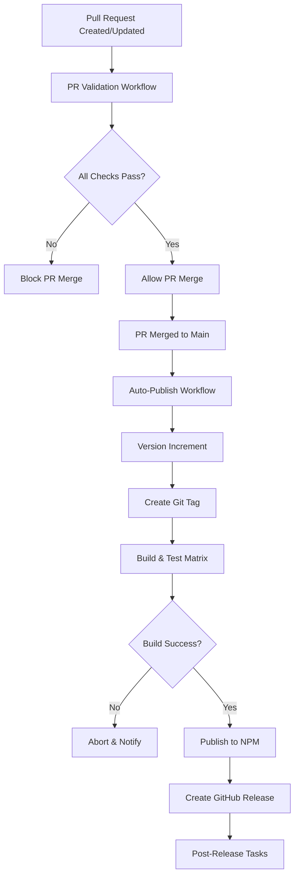

# Design Document - Sistema de Publicação Automática NPM

## Overview

O sistema de publicação automática será implementado através de workflows GitHub Actions que criam um pipeline robusto de CI/CD. O design integra e melhora os workflows existentes, criando um fluxo automatizado desde a validação de pull requests até a publicação no npm registry.

## Architecture

### Workflow Structure



### Workflow Integration Strategy

1. **Consolidação de Workflows Existentes**: Integrar funcionalidades dos workflows atuais (ci.yml, security.yml, release.yml) em dois workflows principais
2. **Separação de Responsabilidades**: Um workflow para validação de PR e outro para publicação automática
3. **Reutilização de Jobs**: Criar jobs reutilizáveis para evitar duplicação de código

## Components and Interfaces

### 1. PR Validation Workflow (`pr-validation.yml`)

**Triggers:**
- `pull_request` events targeting `main` branch
- `pull_request_target` for external contributors (com permissões limitadas)

**Jobs:**
- `quality-gates`: Lint, format, type-check
- `security-audit`: Dependency vulnerabilities, code analysis
- `test-matrix`: Testes em múltiplas versões Node.js e OS
- `build-validation`: Build e validação de artefatos
- `pr-summary`: Consolidação de resultados

**Outputs:**
- Status de cada verificação
- Relatórios de cobertura
- Análise de segurança
- Métricas de bundle size

### 2. Auto-Publish Workflow (`auto-publish.yml`)

**Triggers:**
- `push` events na branch `main` (após merge de PR)
- `workflow_dispatch` para publicação manual

**Jobs:**
- `version-management`: Análise de commits e incremento de versão
- `pre-publish-validation`: Validação final antes da publicação
- `publish-matrix`: Testes finais em matriz completa
- `npm-publish`: Publicação no registry
- `github-release`: Criação de release e tag
- `post-publish`: Notificações e cleanup

### 3. Shared Actions (Reutilizáveis)

**Setup Action:**
```yaml
# .github/actions/setup-node/action.yml
- Node.js setup com cache
- Instalação de dependências
- Configuração de ambiente
```

**Quality Check Action:**
```yaml
# .github/actions/quality-check/action.yml
- ESLint execution
- Prettier validation
- TypeScript type checking
```

**Security Audit Action:**
```yaml
# .github/actions/security-audit/action.yml
- npm audit
- Dependency analysis
- Vulnerability reporting
```

## Data Models

### Version Management Schema

```typescript
interface VersionIncrement {
  currentVersion: string;
  newVersion: string;
  incrementType: 'patch' | 'minor' | 'major';
  reason: string;
  commitSha: string;
}

interface CommitAnalysis {
  hasBreakingChanges: boolean;
  hasFeatures: boolean;
  hasFixes: boolean;
  conventionalCommits: ConventionalCommit[];
}

interface ConventionalCommit {
  type: 'feat' | 'fix' | 'docs' | 'style' | 'refactor' | 'test' | 'chore';
  scope?: string;
  description: string;
  body?: string;
  footer?: string;
  isBreaking: boolean;
}
```

### Publication Metadata

```typescript
interface PublicationResult {
  version: string;
  npmUrl: string;
  githubReleaseUrl: string;
  publishedFiles: string[];
  bundleSize: BundleAnalysis;
  timestamp: string;
}

interface BundleAnalysis {
  totalSize: number;
  cjsSize: number;
  esmSize: number;
  typesSize: number;
  gzippedSize: number;
}
```

## Error Handling

### Failure Recovery Strategies

1. **Validation Failures:**
   - Bloquear PR merge
   - Comentar no PR com detalhes do erro
   - Permitir re-execução após correções

2. **Publication Failures:**
   - Rollback de versão se possível
   - Notificação imediata aos mantenedores
   - Preservar artefatos para debug
   - Permitir republicação manual

3. **Partial Failures:**
   - Continuar com próximos steps se não crítico
   - Marcar como warning em vez de failure
   - Coletar métricas para análise

### Error Notification System

```yaml
# Notification Strategy
- GitHub PR comments para validation errors
- GitHub Issues para publication failures
- Slack/Discord webhooks para notificações críticas
- Email para mantenedores em casos extremos
```

## Testing Strategy

### PR Validation Testing

1. **Unit Tests:**
   - Execução completa da suite de testes
   - Cobertura mínima de 80%
   - Testes em paralelo para performance

2. **Integration Tests:**
   - Testes end-to-end do CLI
   - Validação de imports (CJS/ESM)
   - Compatibilidade cross-platform

3. **Matrix Testing:**
   - Node.js versions: 16.x, 18.x, 20.x
   - Operating Systems: Ubuntu, Windows, macOS
   - Package managers: npm, yarn, pnpm

### Pre-Publication Testing

1. **Build Validation:**
   - Compilação sem erros
   - Geração correta de tipos
   - Validação de entry points

2. **Package Testing:**
   - Instalação simulada
   - Import/require testing
   - CLI functionality testing

3. **Security Testing:**
   - Audit de dependências
   - Análise de código estático
   - Verificação de licenças

### Performance Monitoring

```yaml
# Métricas a serem coletadas:
- Tempo de execução dos workflows
- Tamanho dos bundles gerados
- Tempo de instalação do pacote
- Performance dos testes
```

## Security Considerations

### Secrets Management

```yaml
# Required Secrets:
NPM_TOKEN: # Token para publicação no npm
GITHUB_TOKEN: # Token automático do GitHub
SLACK_WEBHOOK: # Opcional para notificações
```

### Permission Model

```yaml
# Permissions por workflow:
PR_VALIDATION:
  contents: read
  pull-requests: write
  checks: write

AUTO_PUBLISH:
  contents: write
  packages: write
  pull-requests: read
```

### Security Validations

1. **Dependency Security:**
   - npm audit com threshold configurável
   - Verificação de licenças incompatíveis
   - Análise de dependências desatualizadas

2. **Code Security:**
   - ESLint security rules
   - Verificação de hardcoded secrets
   - Análise de imports suspeitos

## Configuration Management

### Workflow Configuration

```yaml
# .github/workflows/config.yml
env:
  NODE_VERSION: '18.x'
  MIN_COVERAGE: 80
  MAX_BUNDLE_SIZE: '50KB'
  SECURITY_AUDIT_LEVEL: 'moderate'
  NOTIFICATION_CHANNELS: 'github,slack'
```

### Package.json Integration

```json
{
  "publishConfig": {
    "access": "public",
    "registry": "https://registry.npmjs.org/"
  },
  "files": [
    "dist",
    "README.md",
    "LICENSE"
  ],
  "scripts": {
    "prepublishOnly": "npm run quality && npm run build:prod && npm run test"
  }
}
```

## Monitoring and Observability

### Metrics Collection

1. **Workflow Metrics:**
   - Success/failure rates
   - Execution times
   - Resource usage

2. **Publication Metrics:**
   - Frequency of releases
   - Version increment patterns
   - Download statistics

3. **Quality Metrics:**
   - Test coverage trends
   - Security vulnerability counts
   - Bundle size evolution

### Alerting Strategy

```yaml
# Alert Conditions:
- Publication failure
- Security vulnerabilities (high/critical)
- Test coverage drop > 5%
- Bundle size increase > 20%
- Workflow execution time > 15min
```

## Migration Plan

### Phase 1: Workflow Consolidation
- Merge existing workflows into new structure
- Maintain backward compatibility
- Add comprehensive logging

### Phase 2: Enhanced Validation
- Implement advanced security checks
- Add performance monitoring
- Enhance error reporting

### Phase 3: Automation Enhancement
- Implement smart version increment
- Add automatic changelog generation
- Integrate advanced notifications

### Phase 4: Optimization
- Optimize workflow performance
- Implement caching strategies
- Add predictive failure detection