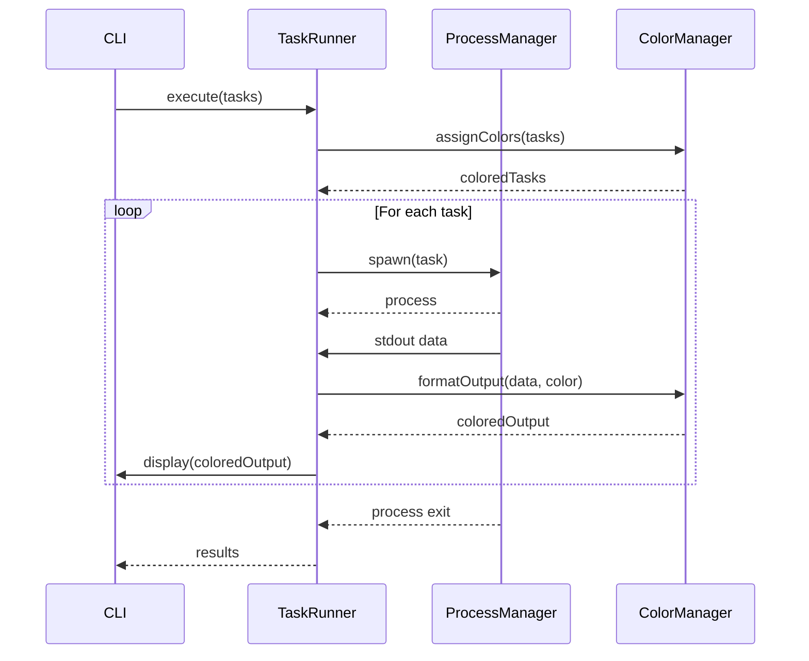

# Design Document

## Overview

Taskly é uma biblioteca TypeScript zero-dependency que permite execução de comandos em paralelo com identificação visual e suporte a múltiplos package managers. O design foca em simplicidade, performance e segurança, oferecendo tanto uma CLI quanto uma API programática.

## Architecture

### High-Level Architecture

```
┌─────────────────┐    ┌─────────────────┐    ┌─────────────────┐
│   CLI Interface │    │  Core Library   │    │ Process Manager │
│                 │────│                 │────│                 │
│ - Argument      │    │ - Task Runner   │    │ - Spawn Control │
│   Parsing       │    │ - Color Manager │    │ - Output Stream │
│ - Config Load   │    │ - PM Detection  │    │ - Error Handle  │
└─────────────────┘    └─────────────────┘    └─────────────────┘
         │                       │                       │
         │                       │                       │
         ▼                       ▼                       ▼
┌─────────────────┐    ┌─────────────────┐    ┌─────────────────┐
│   File System   │    │   Utilities     │    │   Terminal I/O  │
│                 │    │                 │    │                 │
│ - Config Files  │    │ - Validation    │    │ - Color Output  │
│ - PM Detection  │    │ - String Utils  │    │ - Stream Merge  │
└─────────────────┘    └─────────────────┘    └─────────────────┘
```

### Module Structure

```
src/
├── cli/
│   ├── index.ts          # CLI entry point
│   ├── parser.ts         # Argument parsing
│   └── config.ts         # Configuration loading
├── core/
│   ├── task-runner.ts    # Main task execution logic
│   ├── process-manager.ts # Process spawning and management
│   ├── color-manager.ts  # Color assignment and output
│   └── package-manager.ts # PM detection and validation
├── utils/
│   ├── validation.ts     # Input validation
│   ├── file-system.ts    # File system utilities
│   └── terminal.ts       # Terminal utilities
├── types/
│   └── index.ts          # TypeScript type definitions
└── index.ts              # Library entry point
```

## Components and Interfaces

### Core Interfaces

```typescript
interface TaskConfig {
  command: string;
  identifier?: string;
  color?: string;
  packageManager?: 'npm' | 'yarn' | 'pnpm' | 'bun';
  cwd?: string;
}

interface TaskResult {
  identifier: string;
  exitCode: number;
  output: string[];
  error?: string;
  duration: number;
}

interface TasklyOptions {
  tasks: TaskConfig[];
  killOthersOnFail?: boolean;
  maxConcurrency?: number;
  prefix?: string;
  timestampFormat?: string;
}
```

### CLI Interface

```typescript
interface CLIOptions {
  commands: string[];
  names?: string[];
  colors?: string[];
  packageManager?: string;
  killOthersOnFail?: boolean;
  maxConcurrency?: number;
  config?: string;
}
```

### Core Components

#### 1. TaskRunner
- **Purpose**: Orchestrates parallel task execution
- **Responsibilities**:
  - Manages task lifecycle
  - Coordinates process spawning
  - Handles task completion and cleanup
  - Implements kill-others-on-fail logic

#### 2. ProcessManager
- **Purpose**: Manages individual process execution
- **Responsibilities**:
  - Spawns child processes using Node.js `child_process`
  - Captures stdout/stderr streams
  - Handles process termination
  - Implements timeout mechanisms

#### 3. ColorManager
- **Purpose**: Manages color assignment and terminal output
- **Responsibilities**:
  - Assigns unique colors to tasks
  - Formats output with ANSI color codes
  - Handles color cycling for multiple tasks
  - Provides color validation

#### 4. PackageManagerDetector
- **Purpose**: Detects and validates package managers
- **Responsibilities**:
  - Checks PM availability in system PATH
  - Detects project PM from lock files
  - Validates PM compatibility
  - Provides fallback mechanisms

## Data Models

### Task Execution Flow



### Color Assignment Strategy

```typescript
const DEFAULT_COLORS = [
  'red', 'green', 'yellow', 'blue', 'magenta', 'cyan',
  'brightRed', 'brightGreen', 'brightYellow', 'brightBlue',
  'brightMagenta', 'brightCyan'
];
```

### Package Manager Detection Logic

1. Check if specified PM exists in PATH
2. If not found, scan for lock files:
   - `package-lock.json` → npm
   - `yarn.lock` → yarn
   - `pnpm-lock.yaml` → pnpm
   - `bun.lockb` → bun
3. Fallback to npm if no lock files found
4. Validate final PM availability

## Error Handling

### Error Categories

1. **Validation Errors**
   - Invalid command syntax
   - Missing required parameters
   - Invalid package manager specification

2. **Runtime Errors**
   - Process spawn failures
   - Command execution errors
   - Package manager not found

3. **System Errors**
   - File system access errors
   - Permission denied errors
   - Resource exhaustion

### Error Handling Strategy

```typescript
class TasklyError extends Error {
  constructor(
    message: string,
    public code: string,
    public task?: string
  ) {
    super(message);
    this.name = 'TasklyError';
  }
}

// Error codes
const ERROR_CODES = {
  INVALID_COMMAND: 'INVALID_COMMAND',
  PM_NOT_FOUND: 'PM_NOT_FOUND',
  SPAWN_FAILED: 'SPAWN_FAILED',
  TASK_FAILED: 'TASK_FAILED'
} as const;
```

## Security Considerations

### Command Injection Prevention

1. **Input Sanitization**: Validate all command inputs
2. **Shell Escaping**: Properly escape shell arguments
3. **Command Whitelist**: Optional command validation
4. **Path Validation**: Validate working directories

### Process Security

1. **Resource Limits**: Implement memory and CPU limits
2. **Timeout Controls**: Prevent runaway processes
3. **Signal Handling**: Proper cleanup on termination
4. **Environment Isolation**: Control environment variables

## Testing Strategy

### Unit Tests (Vitest)

1. **Core Logic Tests**
   - Task execution logic
   - Color assignment algorithms
   - Package manager detection
   - Input validation

2. **Utility Tests**
   - File system operations
   - String formatting
   - Error handling

### Integration Tests

1. **CLI Tests**
   - Argument parsing
   - Configuration loading
   - End-to-end command execution

2. **Process Tests**
   - Multi-process execution
   - Output capturing
   - Error propagation

### Test Coverage Strategy

- **Target**: 90% minimum, 100% desired
- **Focus Areas**:
  - Critical path coverage
  - Error condition testing
  - Edge case validation
  - Cross-platform compatibility

### Mock Strategy

```typescript
// Mock child_process for testing
jest.mock('child_process', () => ({
  spawn: jest.fn().mockImplementation(() => ({
    stdout: { on: jest.fn() },
    stderr: { on: jest.fn() },
    on: jest.fn()
  }))
}));
```

## Build and Distribution

### TypeScript Configuration

```json
{
  "compilerOptions": {
    "target": "ES2020",
    "module": "commonjs",
    "declaration": true,
    "outDir": "./dist/cjs",
    "strict": true,
    "esModuleInterop": true
  }
}
```

### Dual Package Support

- **CommonJS**: `dist/cjs/` with `package.json` type: "commonjs"
- **ESM**: `dist/esm/` with `package.json` type: "module"
- **Types**: Shared `.d.ts` files for both formats

### Bundle Optimization

1. **Tree Shaking**: ESM build supports tree shaking
2. **Code Splitting**: Separate CLI and library bundles
3. **Minification**: Production builds minified
4. **Size Analysis**: Bundle size monitoring in CI

### GitHub Actions Workflow

```yaml
name: Release
on:
  push:
    tags: ['v*']
jobs:
  release:
    runs-on: ubuntu-latest
    steps:
      - uses: actions/checkout@v3
      - uses: actions/setup-node@v3
      - run: npm ci
      - run: npm test
      - run: npm run build
      - run: npm publish
        env:
          NODE_AUTH_TOKEN: ${{ secrets.NPM_TOKEN }}
```

## Performance Considerations

### Execution Performance

1. **Parallel Execution**: True parallelism using child processes
2. **Stream Processing**: Real-time output streaming
3. **Memory Management**: Efficient buffer handling
4. **CPU Optimization**: Minimal overhead processing

### Bundle Size Optimization

1. **Zero Dependencies**: No runtime dependencies
2. **Tree Shaking**: Dead code elimination
3. **Minimal API Surface**: Focused functionality
4. **Efficient Algorithms**: Optimized core logic

Target bundle sizes:
- **Minified**: < 50KB
- **Gzipped**: < 15KB